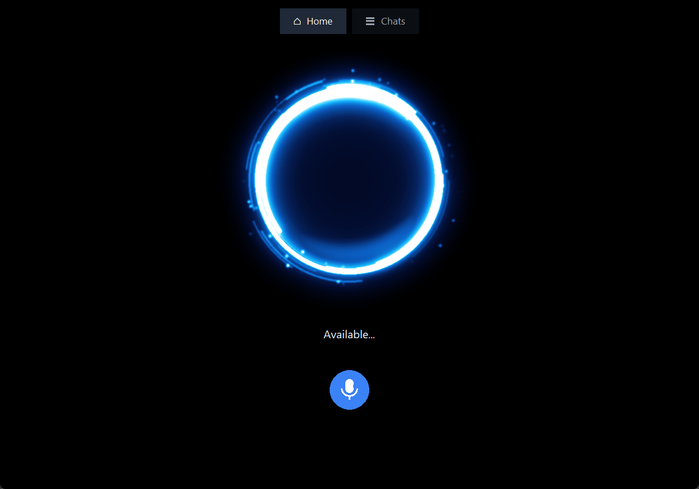
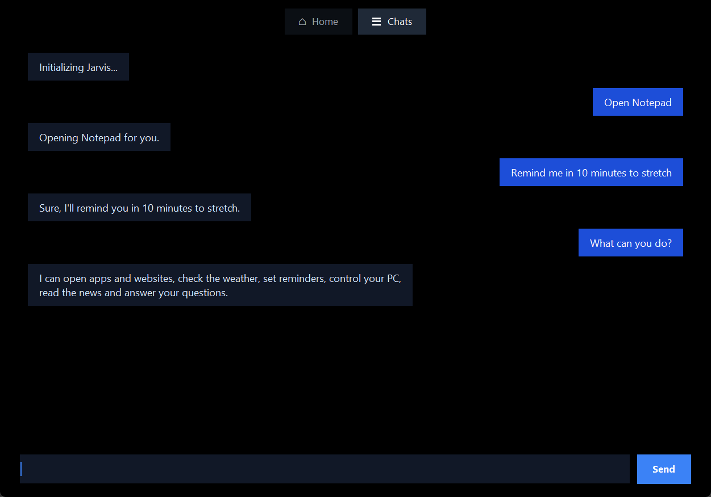

# Jarvis: AI Voice Assistant for Windows

Jarvis is a voice assistant written in Python, inspired by J.A.R.V.I.S. from Iron Man. Say **"Jarvis"**, ask for something, and it answers out loud. It can answer questions with AI, open apps and websites, check the weather, set reminders, control your PC, read the news, and even look at your screen.

It runs for free: it uses Groq's free AI plan, free voices and free data sources.

<p align="center">
  
  
</p>

## Features

- **Wake word:** say "Jarvis" and it replies "Yes?", or say it all at once: "Jarvis, open YouTube". After each command it keeps listening for a few seconds, so you can give the next one without saying "Jarvis" again.
- **AI answers:** short, natural spoken answers from Groq's AI. It remembers the conversation and knows the date and time, and it says "Let me check" while it thinks.
- **Interrupt it anytime:** say "stop" or "wait" while Jarvis is talking, press Esc, or click the orb.
- **Opens apps and websites:** Notepad, Command Prompt, Terminal, File Explorer, Calculator, Task Manager, Settings, your Downloads folder, any website, or a Google search.
- **Weather:** the weather now and for the next 3 days in any city.
- **Reminders:** "Remind me in 10 minutes to stretch". Jarvis beeps and tells you when it's time, even if you restarted it in between.
- **Memory:** "Remember that my exam is on Friday", then later "When is my exam?"
- **PC controls:** volume, pause and skip music, screen brightness, lock the PC, take a screenshot, and shut down or restart (after a one-minute delay you can cancel).
- **Clipboard and typing:** "Explain what I copied" explains copied text or an error message. "Type hello world" types into the app you're using.
- **"What's on my screen?":** Jarvis takes a picture of your screen and an AI that can read images describes it or answers questions about it.
- **News and music:** reads the top BBC World headlines, and plays songs from your own list or the top YouTube result.
- **Jarvis window:** an animated glowing orb that shows what Jarvis is doing, a microphone button, and a Chats page where you can also type commands.

## How it works

1. Your microphone is always on. Each thing you say is turned into text by **Whisper** on Groq (Google's free recognizer is the backup).
2. If it starts with "Jarvis", the rest is your command. Simple commands like "open YouTube" run straight away.
3. Anything else goes to **Groq's AI** (`gpt-oss-120b`), which either answers or picks one of Jarvis's tools (open an app, get the weather, set a reminder...).
4. The answer is spoken with a natural voice from **edge-tts**, while the window's orb pulses along with it.

## Requirements

- Windows 10 or 11
- **Python 3.13.** PyAudio, which Jarvis uses for the microphone, can't be installed on Python 3.14 yet.
- A microphone, speakers and an internet connection
- A free Groq API key (see below)

## Installation

```powershell
git clone https://github.com/zarishnasir123/Python_Project1_JARVIS.git
cd Python_Project1_JARVIS

py -3.13 -m venv .venv
.venv\Scripts\activate

pip install SpeechRecognition PyAudio pyttsx3 edge-tts miniaudio pillow
```

### Add your free Groq API key

1. Sign up at [console.groq.com/keys](https://console.groq.com/keys) and click **Create API Key**.
2. Create a file called `config.py` next to `main.py`, containing:

   ```python
   GROQ_API_KEY = "your-key-here"
   ```

`config.py` is listed in `.gitignore`, so your key is never uploaded to GitHub. You can also set a `GROQ_API_KEY` environment variable instead.

## Running Jarvis

```powershell
python main.py               # with the Jarvis window
python main.py --no-window   # in the terminal only
```

Stay quiet for a second while it says "Calibrating microphone". The first start also takes a few seconds to draw the orb; after that it starts instantly.

## Things you can say

| You say | Jarvis |
| --- | --- |
| "Jarvis" | Says "Yes?" and listens for your command |
| "Jarvis, open YouTube" | Opens YouTube |
| "Open Notepad", "Open file manager", "Open terminal" | Opens it |
| "What's the weather in London?" | Tells you the weather and the next few days |
| "Remind me in 10 minutes to stretch" | Reminds you in 10 minutes |
| "Remember that my exam is on Friday" | Remembers it, even after a restart |
| "Turn the volume up", "Pause the music", "Lock my PC" | Does it |
| "Take a screenshot" | Saves it in Pictures/Screenshots |
| "Explain what I copied" | Explains the text or error you copied |
| "Type hello world" | Types it into the app you're using |
| "What's on my screen?" | Looks at your screen and tells you |
| "Read the news" | Reads the top 5 BBC World headlines |
| "Play music", "Play Shape of You" | Plays it on YouTube |
| "Stop" (while Jarvis is talking) | Stops and says "I'm listening" |

You can also type any of these on the **Chats** page.

## Project structure

```text
main.py            listening, the AI, speaking and the main loop
interface.py       the Jarvis window: orb, Chats page, microphone button
features.py        weather, reminders, memory, PC controls, clipboard and screen
musicLibrary.py    your own song links for "play music"
config.py          your Groq API key (you create it; never uploaded)
assets/            screenshots for this README
memory.json        what you asked Jarvis to remember (created automatically, never uploaded)
reminders.json     your reminders (created automatically, never uploaded)
```

## Customizing

The settings at the top of `main.py` let you change:

- `VOICE`: Jarvis's voice. Any edge-tts voice works, for example `en-US-GuyNeural`.
- `WAKE_REPLY`: what Jarvis says when you call it ("Yes?").
- `FOLLOW_UP_SECONDS`: how long it keeps listening after a command.
- `FILLERS`: what it says while it thinks.
- `STOP_WORDS`: the words that interrupt it.
- `APPS`: the programs and folders it can open.
- `NEWS_FEED`: where the headlines come from.

To add your own songs, put them in `musicLibrary.py`: write the song name without spaces, followed by its YouTube link.

## Privacy

- What you say is sent to Groq to be turned into text, and your questions are answered by Groq's AI.
- "What's on my screen?" sends a picture of your screen to Groq.
- Jarvis's voice comes from Microsoft's online voice service (edge-tts).
- Your API key, memories and reminders stay on your PC: `config.py`, `memory.json` and `reminders.json` are in `.gitignore`.

## Troubleshooting

- **PyAudio won't install:** use Python 3.13.
- **Jarvis doesn't hear you:** check your microphone in Windows Settings > System > Sound > Input, and stay quiet while it calibrates.
- **"Groq didn't accept my API key":** check the key in `config.py`.
- **The voice sounds robotic:** install `edge-tts` and `miniaudio`. Without them, Jarvis uses the built-in Windows voice.
- **"I've reached Groq's free limit":** the free plan has per-minute and daily limits. Jarvis switches to a smaller AI model when the main one is busy; you can see your limits in your Groq console settings.

## Built with

Python, [SpeechRecognition](https://pypi.org/project/SpeechRecognition/) and PyAudio, [Groq](https://groq.com) (Whisper, gpt-oss and Qwen), [edge-tts](https://pypi.org/project/edge-tts/), miniaudio, Pillow and tkinter, [Open-Meteo](https://open-meteo.com) for the weather, and BBC News for the headlines.

Made by [Zarish Nasir](https://github.com/zarishnasir123).
